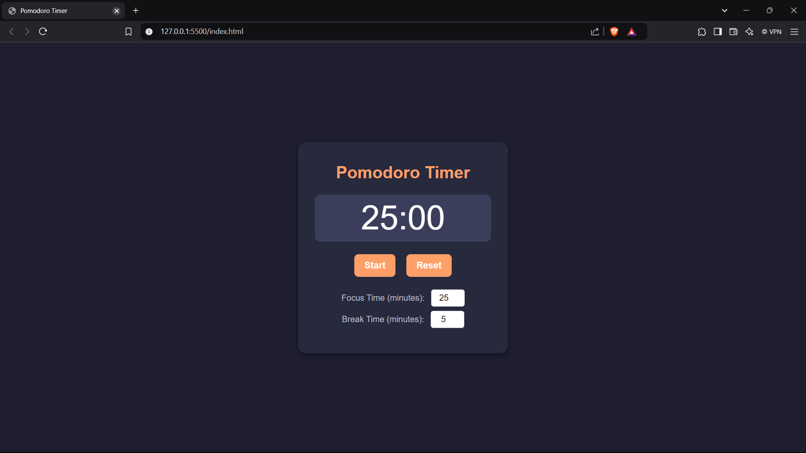

# Pomodoro Timer ⏳

A customizable and simple Pomodoro Timer to help manage productivity by alternating between focus and break intervals. Built with HTML, CSS, and JavaScript, this timer provides a visually pleasing interface, sound notifications, and customizable intervals, perfect for time management enthusiasts.

## Features
- **Customizable Intervals**: Set preferred durations for focus and break sessions.
- **Sound Notifications**: Get notified with sound cues at the end of each interval.
- **Responsive Design**: Clean and intuitive interface that works well on both desktop and mobile.
- **Simple Controls**: Start, pause, and reset the timer easily.

## Technologies Used
- **HTML**: For the structure of the timer interface.
- **CSS**: For styling and enhancing the user interface.
- **JavaScript**: For implementing timer functionality, interval switching, and sound notifications.

## Getting Started

### Installation
To run this project locally:

1. **Clone the Repository**:
   ```bash
   git clone https://github.com/CoderDebajyoti/Pomodoro-Timer.git
   ```
2. **Open `index.html`** in your browser to start the timer.

### Usage
1. Set your desired focus and break intervals.
2. Start the timer to begin the focus session.
3. At the end of each session, sound notifications will alert you to switch between focus and break modes.
4. Use the pause and reset buttons as needed to manage your sessions.

## Screenshots


## Project Structure
- **index.html**: The main HTML file for the structure of the app.
- **style.css**: Contains CSS for styling and layout.
- **script.js**: Holds the JavaScript for timer functionality, session control, and notifications.

## Issues
### Current Development Focus
1. **Implement Timer Functionality**: Add start, pause, and reset functions to manage the countdown.
2. **Improve UI/UX with CSS**: Update styles for a more polished, user-friendly interface.
3. **Add Sound Notifications**: Include sounds at the end of each interval for focus and break sessions.

## Contributing
Contributions are welcome! If you have suggestions or improvements, please open an issue or submit a pull request.

## License
This project is licensed under the **Eclipse Public License - v 2.0**. See the [LICENSE](LICENSE) file for more details.

## Contact
For any questions or suggestions, please feel free to reach out via email at **debajyoti.475@gmail.com**.

---

